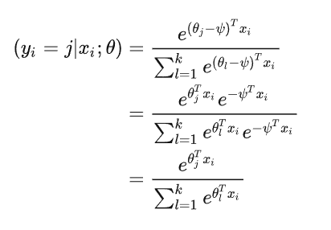
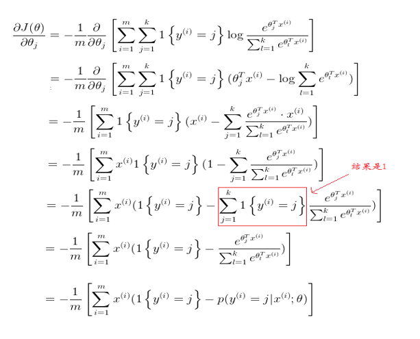
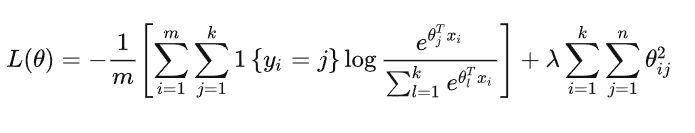

机器学习实验报告（一）
==================================

-----

>专业：计算机科学与技术
>学号：2011188
>姓名：邵琦


<!-- @import "[TOC]" {cmd="toc" depthFrom=1 depthTo=6 orderedList=false} -->

<!-- code_chunk_output -->

- [机器学习实验报告（一）](#机器学习实验报告一)
- [一、实验要求](#一实验要求)
- [二、程序实现原理](#二程序实现原理)
  - [2.1 数据预处理](#21-数据预处理)
  - [2.2 softmax函数实现](#22-softmax函数实现)
    - [2.2.1 计算softmax值](#221-计算softmax值)
    - [2.2.2 损失函数](#222-损失函数)
    - [2.2.3 梯度](#223-梯度)
    - [2.2.4 正则化](#224-正则化)
  - [2.3 训练模型以及模型评估](#23-训练模型以及模型评估)
- [三、代码细节](#三代码细节)
  - [3.1 引入所需的包和库](#31-引入所需的包和库)
  - [3.2 数据预处理（data_process.py）](#32-数据预处理data_processpy)
  - [3.3 softmax函数（softmax_regression.py）](#33-softmax函数softmax_regressionpy)
  - [3.4 模型训练（train.py）](#34-模型训练trainpy)
  - [3.5 测试数据及模型评估（evaluate.py）](#35-测试数据及模型评估evaluatepy)
  - [3.6 主函数（main.py）](#36-主函数mainpy)
- [四、实验结果](#四实验结果)
- [五、实验结果的分析](#五实验结果的分析)
  - [5.1 实验问题](#51-实验问题)
  - [5.2 改进](#52-改进)
- [六、总结](#六总结)

<!-- /code_chunk_output -->


# 一、实验要求

在这个练习中，需要训练⼀个分类器来完成对MNIST数据集中 0-9 10个手写数字的分类。

# 二、程序实现原理

实验采取softmax函数（归一化指数函数）的逻辑回归算法。Softmax回归是多类别分类模型，也称为多类逻辑回归，其实是logistic回归的一般形式，logistic回归用于二类，而softmax回归用于多分类。在自然语言处理中，又被称为最大熵模型。它是逻辑函数的一种推广。它能将一个含任意实数的K维向量z“压缩”到另一个K维实向量σ(z)中，使得每一个元素的范围都在(0,1)之间，并且所有元素的和为1。该函数多于多分类问题中。


## 2.1 数据预处理

首先打开并读取文件数据，获取相应数据并区分训练集与测试集。

其中获取了x，y，theta三个矩阵，x矩阵存储了训练集的图片数据，维数为m(60000) * n(784)，存储了60000个784像素组成的图片数据，每一行为一张图片的特征值。y矩阵存储了每一张图片的标签，维数为 k(10) * m(60000)。y矩阵使用了独热编码，对于10分类，每一列只有标签一个元素为1，其余均为0，为1的元素位置表示所在列图片的标签。theta为参数矩阵（最初为随机生成），维数为k(10) * n(784)。

除此以外，本实验还使用了m，n，k，iters，alpha，lam等参数。m为训练集的图片个数，n为每个训练集图片的像素个数，k为分类的种数，iters为训练迭代次数，alpha为更新theta矩阵的参数，lam为计算损失值和梯度时的正则化项参数。

## 2.2 softmax函数实现

### 2.2.1 计算softmax值

softmax值的计算如图所示，这个值对于之后的损失函数求值以及梯度计算有很大的作用。



### 2.2.2 损失函数

损失函数的计算如下图所示：


### 2.2.3 梯度

梯度计算如下图所示：



在每一次计算迭代后，根据计算所得的梯度矩阵更新theta矩阵，并进行下一轮迭代。

### 2.2.4 正则化

当训练数据不够多的时候，容易出现过拟合现象，拟合系数往往非常大，为此在损失函数后面加上一个正则项:



新的损失函数的梯度为：


## 2.3 训练模型以及模型评估

在数据预处理以及设计好函数之后，对训练集进行训练，训练好模型后，使用测试集计算accuracy值进行模型评估。

# 三、代码细节

## 3.1 引入所需的包和库

```python
import numpy as np
import struct
import os
import matplotlib.pyplot as plt
```

## 3.2 数据预处理（data_process.py）

load_mnist函数负责读取图片和标签信息，储存进矩阵中，并输出读入信息的相关数据。

data_convert函数负责对读入进来的数据进行处理，对x矩阵像素灰度小于等于40的特征值置为0，大于置为1。对y矩阵进行独热编码。

load_data函数读取数据，调用load_mnist函数，区分训练集以及测试集。

```python
#dara process
def load_mnist(file_dir, is_images='True'):
    # Read binary data
    bin_file = open(file_dir, 'rb')
    bin_data = bin_file.read()
    bin_file.close()
    # Analysis file header
    if is_images:
        # Read images
        fmt_header = '>iiii'
        magic, num_images, num_rows, num_cols = struct.unpack_from(fmt_header, bin_data, 0)
    else:
        # Read labels
        fmt_header = '>ii'
        magic, num_images = struct.unpack_from(fmt_header, bin_data, 0)
        num_rows, num_cols = 1, 1
    data_size = num_images * num_rows * num_cols
    mat_data = struct.unpack_from('>' + str(data_size) + 'B', bin_data, struct.calcsize(fmt_header))
    mat_data = np.reshape(mat_data, [num_images, num_rows * num_cols])
    print('Load images from %s, number: %d, data shape: %s' % (file_dir, num_images, str(mat_data.shape)))
    return mat_data

# tranfer the image from gray to binary and get the one-hot style labels
def data_convert(x, y, m, k):
    x[x<=40]=0
    x[x>40]=1
    ont_hot_y = np.zeros((m,k))    
    for t in np.arange(0,m):
        ont_hot_y[t,y[t]]=1
    ont_hot_y=ont_hot_y.T
    return x, ont_hot_y

# call the load_mnist function to get the images and labels of training set and testing set
def load_data(mnist_dir, train_data_dir, train_label_dir, test_data_dir, test_label_dir):
    print('Loading MNIST data from files...')
    train_images = load_mnist(os.path.join(mnist_dir, train_data_dir), True)
    train_labels = load_mnist(os.path.join(mnist_dir, train_label_dir), False)
    test_images = load_mnist(os.path.join(mnist_dir, test_data_dir), True)
    test_labels = load_mnist(os.path.join(mnist_dir, test_label_dir), False)
    return train_images, train_labels, test_images, test_labels
```

## 3.3 softmax函数（softmax_regression.py）

在函数中，设定正则项参数lam。在函数中进行iters次迭代。每一次迭代中，依据原理处给定的公式先计算出softmax值，然后计算出函数的损失值和损失函数的梯度，并依据计算所得数据更新theta矩阵，最后返回训练完成的theta矩阵。（为了方便观察模型的精确度，在最后使用plt包画出了函数的损失值变化曲线）

```python
#softmax_regression
def softmax_regression(theta, x, y, iters, alpha):
    # TODO: Do the softmax regression by computing the gradient and 
    # the objective function value of every iteration and update the theta
    f=list()#损失函数
    lam=0.01

    for i in range(iters):
        # 计算 m * k 的分数矩阵
        scores = np.dot(theta,x.T)
        #计算softmax值
        sum_exp=np.sum(np.exp(scores),axis=0)
        softmax =np.exp(scores)/ sum_exp
        # 计算损失函数值
        loss=0.0
        softmax_log=np.log(softmax)
        for i in range(len(x)):
            loss+=np.dot(softmax_log[:,i].T,y[:,i])
        loss = - (1.0 / len(x)) * loss
        loss=loss+lam*np.sum(theta**2)
        f.append(loss)
        # 求解梯度
        g = -(1.0 / len(x)) * np.dot((y-softmax),x) + lam * theta
        # 更新权重矩阵
        theta  = theta - alpha * g
        
    fig = plt.figure(figsize=(8,5))
    plt.plot(np.arange(iters), f)
    plt.title("Development of loss during training")
    plt.xlabel("Number of iterations")
    plt.ylabel("Loss")
    plt.show()
    return theta
```

## 3.4 模型训练（train.py）

在训练函数中，进行m，n变量和x，y，theta矩阵的初始化，并调用softmax_regression对theta矩阵进行训练并返回。

```python
def train(train_images, train_labels, k, iters = 5, alpha = 0.5):
    m, n = train_images.shape
    # data processing
    x, y = data_convert(train_images, train_labels, m, k) # x:[m,n], y:[1,m]
    
    # Initialize theta.  Use a matrix where each column corresponds to a class,
    # and each row is a classifier coefficient for that class.
    theta = np.random.rand(k, n) # [k,n]
    # do the softmax regression
    theta = softmax_regression(theta, x, y, iters, alpha)
    return theta
```

## 3.5 测试数据及模型评估（evaluate.py）

predict函数对训练好的theta矩阵和测试集矩阵进行相乘并取最高概率的标签为预测结果。

cal_accuracy函数为自行实现，通过对比预测结果和标签给定结果的差异，计算正确预测的个数，并除以总个数，作为准确率进行返回。

```python
def predict(test_images, theta):
    scores = np.dot(test_images, theta.T)
    preds = np.argmax(scores, axis=1)
    return preds

def cal_accuracy(y_pred, y):
    # TODO: Compute the accuracy among the test set and store it in acc
    num=0.0
    for i in range(len(y)):
        if(y_pred[i]==int(y[i])):
            num+=1
    acc=num/len(y)
    return acc
```

## 3.6 主函数（main.py）

主函数中调用先前的函数，分别进行了参数定义，数据加载，训练，预测，输出准确率等工作。

```python
mnist_dir = "mnist_data/"
train_data_dir = "train-images.idx3-ubyte"
train_label_dir = "train-labels.idx1-ubyte"
test_data_dir = "t10k-images.idx3-ubyte"
test_label_dir = "t10k-labels.idx1-ubyte"
k = 10
iters = 500
alpha = 0.5    
# get the data
train_images, train_labels, test_images, test_labels = load_data(mnist_dir, train_data_dir, train_label_dir, test_data_dir, test_label_dir)
print("Got data. ") 

# train the classifier
theta = train(train_images, train_labels, k, iters, alpha)
print("Finished training. ") 

# evaluate on the testset
y_predict = predict(test_images, theta)
accuracy  = cal_accuracy(y_predict, test_labels)
print("Finished test. ") 
print(accuracy)
```

# 四、实验结果

最终得出实验的精确度为：0.9062。说明实验模型对于MNIST数据集中10个手写数字的分类具有较好的精确度。

# 五、实验结果的分析

实验记录每一次训练所得的损失值，绘制图像如下。可以发现损失值一直在降低，模型一直在优化。


## 5.1 实验问题

在开始时，使用for循环计算梯度时，发现计算速度十分缓慢。后面尝试通过矩阵计算进行优化，缩短了训练时间。

## 5.2 改进

可以尝试通过调整参数大小进行预测准确率的优化提升。

# 六、总结

通过本次实验，我对机器学习中逻辑回归算法以及softmax函数算法有了更深刻的理解与认识，对于机器学习的相关知识也有了更好的了解与掌握。