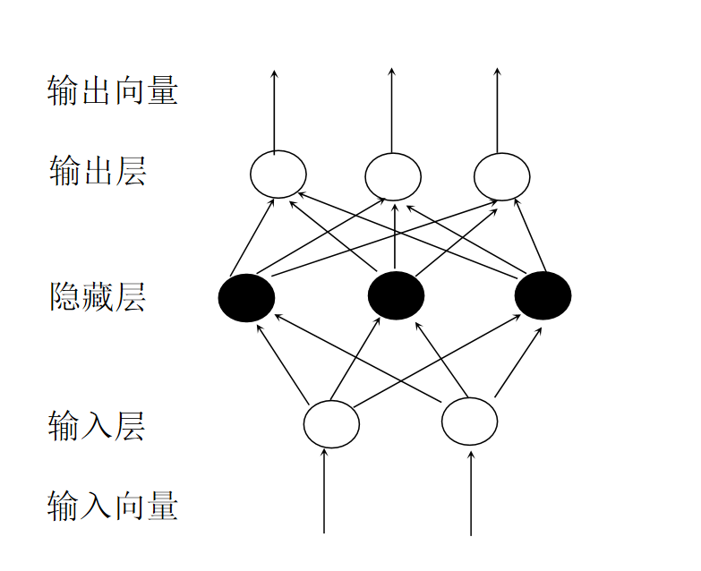

机器学习第二次作业
==================================

-----

>专业：计算机科学与技术
>学号：2011188
>姓名：邵琦

<!-- @import "[TOC]" {cmd="toc" depthFrom=1 depthTo=6 orderedList=false} -->

<!-- code_chunk_output -->

- [一、实验要求](#一-实验要求)
- [二、三层感知机](#二-三层感知机)
- [三、反向传播算法更新MLP的权重和偏置项](#三-反向传播算法更新mlp的权重和偏置项)
  - [输出层权重与偏置更新](#输出层权重与偏置更新)
    - [权重更新](#权重更新)
    - [偏置更新](#偏置更新)
  - [隐藏层权重与偏置更新](#隐藏层权重与偏置更新)
    - [权重更新](#权重更新-1)
    - [偏置更新](#偏置更新-1)
  - [更新方式](#更新方式)

<!-- /code_chunk_output -->

# 一、实验要求

在这个练习中，你需要以三层感知机为例，使用反向传播算法更新MLP的权重和偏置项，并将推导过程以报告的形式提交。

MLP以及权重、偏置项的定义如下：

# 二、三层感知机

权重矩阵 $ S_w = \displaystyle \sum^{C}_{c=1}{\displaystyle \sum_{y^M_i\in c}{(y_i^M-m_c^M)(y_i^M-m_c^M)^T}} $

偏置项矩阵 $ S_b = \displaystyle \sum^{C}_{c=1}{n_c(m_c^M-m^M)(m_c^M-m^M)^T} $

误差评估函数 $ E = \displaystyle \sum_{i}{\displaystyle \sum_{j}{\frac{1}{2}(y_{i,j}^M-d_{i,j})^2}}+\frac{1}{2}\gamma(tr(S_w)-tr(S_b)) $

# 三、反向传播算法更新MLP的权重和偏置项

## 输出层权重与偏置更新

### 权重更新

$$\begin{aligned}
\Delta W_{ij}^2 &= \displaystyle \sum^{n-1}_{k=0}({-\eta}\frac{\partial E}{\partial W_{ij}^2})\\
&= \displaystyle \sum^{n-1}_{k=0}({-\eta}\frac{\partial E}{\partial net_{ki}^2}\cdot \frac{\partial net_{ki}^2}{\partial W_{ij}^2})\\
&=-\displaystyle \sum^{n-1}_{k=0}{\eta}\frac{\partial E}{\partial out_{ki}^2}\cdot \frac{\partial out_{ki}^2}{\partial net_{ki}^2}\cdot \frac{\partial net_{ki}^2}{\partial W_{ij}^2}\\
&=-\displaystyle \sum^{n-1}_{k=0}{\frac{\partial E}{\partial out_{ki}^2}\cdot \eta \cdot out_{ki}^2(1-out_{ki}^2)\cdot out_{ki}^1}\\
&=-\displaystyle \sum^{n-1}_{k=0}{\eta \epsilon_{ki}\cdot out_{ki}^2(1-out_{ki}^2)\cdot out_{ki}^1}
\end{aligned}$$

### 偏置更新

$$\begin{aligned}
\Delta b_{i}^2 &= \displaystyle \sum^{n-1}_{k=0}({-\eta}\frac{\partial E}{\partial b_i^2})\\
&= \displaystyle \sum^{n-1}_{k=0}({-\eta}\frac{\partial E}{\partial net_{ki}^2}\cdot \frac{\partial net_{ki}^2}{\partial b_i^2})\\
&=-\displaystyle \sum^{n-1}_{k=0}{\eta}\frac{\partial E}{\partial out_{ki}^2}\cdot \frac{\partial out_{ki}^2}{\partial net_{ki}^2}\cdot \frac{\partial net_{ki}^2}{\partial b_i^2}\\
&=-\displaystyle \sum^{n-1}_{k=0}{\frac{\partial E}{\partial out_{ki}^2}\cdot \eta \cdot out_{ki}^2(1-out_{ki}^2)}\\
&=-\displaystyle \sum^{n-1}_{k=0}{\eta \epsilon_{ki}\cdot out_{ki}^2(1-out_{ki}^2)}
\end{aligned}$$

$$\begin{aligned}
\epsilon_{ki} &= \frac{\partial E}{\partial net_{ki}^2}\\
&=2(out_{ki}^2-d_{ki})+\frac{1}{2}\gamma(\frac{\partial \operatorname{Tr}\left(S_w\right)}{\partial out_{ki}^{2}}-\frac{\partial\left(\operatorname{Tr}\left(S_b\right)\right)}{\partial out_{ki}^{2}})
\end{aligned}$$

而：

$$\begin{aligned}
\frac{1}{2} \cdot \frac{\partial \operatorname{Tr}\left(S_w\right)}{\partial out_{ki}^{2}}&=\left(1-\frac{1}{n_c}\right)\left(out_{ki}^{2}-m_{c i}^M\right)+\sum_{p=0, p \neq k}^{n_{c}-1}-\frac{1}{n_c}\left(y_{p i}^{2}-m_{c i}^M\right) \\
&=out_{ki}^{2}-m_{c i}^M+\sum_{p=0}^{n_{c}-1}-\frac{1}{n_c}\left(y_{p i}^{2}-m_{c i}^M\right) \\
&=out_{ki}^{2}-m_{c i}^M+\left(-\frac{1}{n_c}\right)\left(n_c m_{c i}^M-n_c m_{c i}^M\right) \\
&=out_{ki}^{2}-m_{c i}^M
\end{aligned}$$

$$\begin{aligned}
\frac{1}{2} \cdot \frac{\partial\left(\operatorname{Tr}\left(S_b\right)\right)}{\partial out_{ki}^{2}}&=n_c\left(\frac{1}{n_c}-\frac{1}{n}\right)\left(m_{c i}^M-m_i^M\right) +\sum_{p=0, p \neq c}^{C-1}-\frac{n_p}{n}\left(m_{p i}^M-m_i^M\right) \\
&=\left(m_{c i}^M-m_i^M\right)+\sum_{p=0}^{c-1}-\frac{n_p}{n}\left(m_{p i}^M-m_i^M\right) \\
&=\left(m_{c i}^M-m_i^M\right)+\left(-\frac{1}{n}\right)\left(n m_i^M-n m_i^M\right) \\
&=m_{c i}^M-m_i^M
\end{aligned}$$

则：

$$\begin{aligned}
\varepsilon_{k i}=& 2\left(out_{ki}^{2}-d_{k i}\right)+\gamma\left(out_{ki}^{2}-m_{c i}^M\right)-\gamma\left(m_{c i}^M-m_i^M\right) \\
=&(2+\gamma) out_{ki}^{2}-2 d_{k i}-2 \gamma m_{c i}^M+\gamma m_i^M
\end{aligned}$$

相关变量（隐藏层同）：

学习率： $ \eta $

第n层由k个向量计算得到的输出向量的第i个值(未经过激活函数)： $ net_{ki}^{n} $

第n层由k个向量计算得到的输出向量的第i个值(经过激活函数)： $ out_{ki}^{n} $

输出结果中属于c类的向量个数：$n_{c}$

$$\begin{aligned}
m_{c i}^M=\frac{\sum_{k=0, y_k \in c}^{n_c-1} out_{ki}^{2}}{n_c}
\end{aligned}$$

$$\begin{aligned}
m_i^M&=\frac{\sum_{k=0}^{n-1} out_{ki}^{2}}{n}\\
&=\frac{\sum_{p=0}^{c-1} n_p m_{p i}^M}{n}
\end{aligned}
$$

## 隐藏层权重与偏置更新

### 权重更新

$$\begin{aligned}
\Delta W_{ij}^1 &= \displaystyle \sum^{n-1}_{k=0}({-\eta}\frac{\partial E}{\partial W_{ij}^1})\\
&= \displaystyle \sum^{n-1}_{k=0}({-\eta}\frac{\partial E}{\partial net_{ki}^1}\cdot \frac{\partial net_{ki}^1}{\partial W_{ij}^1})\\
&=-\displaystyle \sum^{n-1}_{k=0}{\eta}\frac{\partial E}{\partial out_{ki}^1}\cdot \frac{\partial out_{ki}^1}{\partial net_{ki}^1}\cdot \frac{\partial net_{ki}^1}{\partial W_{ij}^1}\\
&= -\displaystyle \sum^{n-1}_{k=0}{\eta \displaystyle \sum^{N_{2}-1}_{p=0}{\delta_{kp}^2\frac{\partial net_{kp}^2}{\partial out_{ki}^1}out_{ki}^0out_{ki}^1(1-out_{ki}^1)}}\\
&= -\eta\displaystyle \sum^{n-1}_{k=0}{out_{ki}^0out_{ki}^1(1-out_{ki}^1)\displaystyle \sum^{N_2-1}_{p=0}\delta_{kp}^2W_{ij}^2}
\end{aligned}$$

### 偏置更新

$$\begin{aligned}
\Delta b_{i}^1 &= \displaystyle \sum^{n-1}_{k=0}({-\eta}\frac{\partial E}{\partial b_i^1})\\
&= \displaystyle \sum^{n-1}_{k=0}({-\eta}\frac{\partial E}{\partial net_{ki}^1}\cdot \frac{\partial net_{ki}^1}{\partial b_i^1})\\
&=-\displaystyle \sum^{n-1}_{k=0}{\eta}\frac{\partial E}{\partial out_{ki}^1}\cdot \frac{\partial out_{ki}^1}{\partial net_{ki}^1}\cdot \frac{\partial net_{ki}^1}{\partial b_i^1}\\
&= -\displaystyle \sum^{n-1}_{k=0}{\eta \displaystyle \sum^{N_{2}-1}_{p=0}{\delta_{kp}^2\frac{\partial net_{kp}^2}{\partial out_{ki}^1}out_{ki}^1(1-out_{ki}^1)}}\\
&= -\eta\displaystyle \sum^{n-1}_{k=0}{out_{ki}^1(1-out_{ki}^1)\displaystyle \sum^{N_2-1}_{p=0}\delta_{kp}^2W_{ij}^2}
\end{aligned}$$

其中：

$$\begin{aligned}
\delta _{ki}^2 = \varepsilon_{ki}out_{ki}^2(1-out_{ki}^2)
\end{aligned}$$

## 更新方式

依据上面计算所得，我们可以如下更新权重和偏置：

$$\begin{aligned}
W_{ij}^{n'} = W_{ij}^n+\Delta W_{ij}^n
\end{aligned}$$

$$\begin{aligned}
b_i^{n'} = b_i^n + \Delta b_i^n
\end{aligned}$$