机器学习第三次作业
==================================

-----

>专业：计算机科学与技术
>学号：2011188
>姓名：邵琦


<!-- @import "[TOC]" {cmd="toc" depthFrom=1 depthTo=6 orderedList=false} -->

<!-- code_chunk_output -->

- [一、实验要求](#一-实验要求)
- [二、实验环境](#二-实验环境)
- [三、LeNet5网络结构](#三-lenet5网络结构)
  - [卷积层](#卷积层)
  - [池化层](#池化层)
  - [Lenet-5](#lenet-5)
    - [INPUT层-输入层](#input层-输入层)
    - [C1层-卷积层](#c1层-卷积层)
    - [S2层-池化层（下采样层）](#s2层-池化层下采样层)
    - [C3层-卷积层](#c3层-卷积层)
    - [S4层-池化层（下采样层）](#s4层-池化层下采样层)
    - [C5层-卷积层](#c5层-卷积层)
    - [F6层-全连接层](#f6层-全连接层)
    - [Output层-全连接层](#output层-全连接层)
- [四、代码细节](#四-代码细节)
  - [LeNet5网络结构](#lenet5网络结构)
  - [layer各层](#layer各层)
    - [ReLU](#relu)
    - [Max-Pooling](#max-pooling)
    - [卷积层](#卷积层-1)
    - [全连接层](#全连接层)
  - [数据预处理](#数据预处理)
  - [训练以及测试](#训练以及测试)
- [五、实验结果以及对实验结果的分析](#五-实验结果以及对实验结果的分析)

<!-- /code_chunk_output -->


# 一、实验要求

在这个练习中，需要用Python实现LeNet5来完成对MNIST数据集中 0-9 10个手写数字的分类。代码只能使用python实现，不能使用PyTorch或TensorFlow框架。

# 二、实验环境

语言：Python3.9

IDE：PyCharm Community Edition 2021.2.2

# 三、LeNet5网络结构

LeNet-5出自论文Gradient-Based Learning Applied to Document Recognition，是一种用于手写体字符识别的非常高效的卷积神经网络。

LeNet-5是一种用于手写体字符识别的非常高效的卷积神经网络,能够很好的利用图像的结构信息。其中输入的二维图像，先经过两次卷积层到池化层，再经过全连接层，最后使用softmax分类作为输出层。LeNet-5虽小，但是包含了深度学习的基本模块：卷积层，池化层，全连接层。


## 卷积层

卷积层是卷积神经网络的核心基石。在图像识别里我们提到的卷积是二维卷积，即离散二维滤波器（也称作卷积核）与二维图像做卷积操作，简单的讲是二维滤波器滑动到二维图像上所有位置，并在每个位置上与该像素点及其领域像素点做内积。卷积操作被广泛应用与图像处理领域，不同卷积核可以提取不同的特征，例如边沿、线性、角等特征。在深层卷积神经网络中，通过卷积操作可以提取出图像低级到复杂的特征。


上图给出一个卷积计算过程的示例图，输入图像大小为H=5,W=5,D=3，即5×5大小的3通道（RGB，也称作深度）彩色图像。这个示例图中包含两（用K表示）组卷积核，即图中滤波器W0和W1。在卷积计算中，通常对不同的输入通道采用不同的卷积核，如图示例中每组卷积核包含（D=3）个3×3（用F×F表示）大小的卷积核。另外，这个示例中卷积核在图像的水平方向（W方向）和垂直方向（H方向）的滑动步长为2（用S表示）；对输入图像周围各填充1（用P表示）个0，即图中输入层原始数据为蓝色部分，灰色部分是进行了大小为1的扩展，用0来进行扩展。经过卷积操作得到输出为3×3×2（用Ho×Wo×K表示）大小的特征图，即3×3大小的2通道特征图，其中Ho计算公式为：Ho=(H−F+2×P)/S+1，Wo同理。 而输出特征图中的每个像素，是每组滤波器与输入图像每个特征图的内积再求和，再加上偏置bo，偏置通常对于每个输出特征图是共享的。输出特征图o[:,:,0]中的最后一个−2计算如上图右下角公式所示。

如下为：
H：图片高度；
W：图片宽度；
D：原始图片通道数，也是卷积核个数；
F：卷积核高宽大小；
P：图像边扩充大小；
S：滑动步长。
在卷积操作中卷积核是可学习的参数，每层卷积的参数大小为D×F×F×K。卷积层的参数较少，这也是由卷积层的主要特性即局部连接和共享权重所决定。

局部连接：每个神经元仅与输入神经元的一块区域连接，这块局部区域称作感受野（receptive field）。在图像卷积操作中，即神经元在空间维度（spatial dimension，即上图示例H和W所在的平面）是局部连接，但在深度上是全部连接。对于二维图像本身而言，也是局部像素关联较强。这种局部连接保证了学习后的过滤器能够对于局部的输入特征有最强的响应。局部连接的思想，也是受启发于生物学里面的视觉系统结构，视觉皮层的神经元就是局部接受信息的。

权重共享：计算同一个深度切片的神经元时采用的滤波器是共享的。例上图中计算o[:,:,0]的每个每个神经元的滤波器均相同，都为W0，这样可以很大程度上减少参数。共享权重在一定程度上讲是有意义的，例如图片的底层边缘特征与特征在图中的具体位置无关。但是在一些场景中是无意的，比如输入的图片是人脸，眼睛和头发位于不同的位置，希望在不同的位置学到不同的特征 。请注意权重只是对于同一深度切片的神经元是共享的，在卷积层，通常采用多组卷积核提取不同特征，即对应不同深度切片的特征，不同深度切片的神经元权重是不共享。另外，偏重对同一深度切片的所有神经元都是共享的。

通过介绍卷积计算过程及其特性，可以看出卷积是线性操作，并具有平移不变性（shift-invariant），平移不变性即在图像每个位置执行相同的操作。卷积层的局部连接和权重共享使得需要学习的参数大大减小，这样也有利于训练较大卷积神经网络。

## 池化层


池化是非线性下采样的一种形式，主要作用是通过减少网络的参数来减小计算量，并且能够在一定程度上控制过拟合。通常在卷积层的后面会加上一个池化层。池化包括最大池化、平均池化等。其中最大池化是用不重叠的矩形框将输入层分成不同的区域，对于每个矩形框的数取最大值作为输出层，如上图所示。

## Lenet-5

LeNet-5共有7层，不包含输入，每层都包含可训练参数；每个层有多个Feature Map，每个Feature Map通过一种卷积滤波器提取输入的一种特征，每个Feature Map有多个神经元。


各层参数详解：
1.INPUT层-输入层：输入图像的尺寸统一归一化为32×32。
2.C1层-卷积层：输入图像进行第一次卷积运算。
3.S2层-池化层（下采样层）：在第一次卷积之后进行池化运算。
4.C3层-卷积层：第一次池化之后是第二次卷积。
5.S4层-池化层（下采样层）
6.C5层-卷积层
7.F6层-全连接层
8.Output层-全连接层

### INPUT层-输入层

首先是数据 INPUT 层，输入图像的尺寸统一归一化为32×32。

### C1层-卷积层

输入图片：32×32
卷积核大小：5×5
卷积核种类：6
输出featuremap大小：28×28 （32-5+1）=28
神经元数量：28×28×6
可训练参数：（5×5+1) × 6（每个滤波器5×5=25个unit参数和一个bias参数，一共6个滤波器）
连接数：（5×5+1）×6×28×28=122304

详细说明：对输入图像进行第一次卷积运算（使用 6 个大小为 5×5 的卷积核），得到6个C1特征图（6个大小为28×28的 feature maps, 32-5+1=28）。我们再来看看需要多少个参数，卷积核的大小为5×5，总共就有6×（5×5+1）=156个参数，其中+1是表示一个核有一个bias。对于卷积层C1，C1内的每个像素都与输入图像中的5×5个像素和1个bias有连接，所以总共有156×28×28=122304个连接（connection）。有122304个连接，但是我们只需要学习156个参数，主要是通过权值共享实现的。

### S2层-池化层（下采样层）

输入：28×28
采样区域：2×2
采样方式：4个输入相加，乘以一个可训练参数，再加上一个可训练偏置。结果通过sigmoid
采样种类：6
输出featureMap大小：14×14（28/2）
神经元数量：14×14×6
连接数：（2×2+1）×6×14×14
S2中每个特征图的大小是C1中特征图大小的1/4。

详细说明：第一次卷积之后紧接着就是池化运算，使用 2×2核 进行池化，于是得到了S2，6个14×14的 特征图（28/2=14）。S2这个pooling层是对C1中的2×2区域内的像素求和乘以一个权值系数再加上一个偏置，然后将这个结果再做一次映射。同时有5x14x14x6=5880个连接。

### C3层-卷积层

输入：S2中所有6个或者几个特征map组合
卷积核大小：5×5
卷积核种类：16
输出featureMap大小：10×10 (14-5+1)=10
C3中的每个特征map是连接到S2中的所有6个或者几个特征map的，表示本层的特征map是上一层提取到的特征map的不同组合
存在的一个方式是：C3的前6个特征图以S2中3个相邻的特征图子集为输入。接下来6个特征图以S2中4个相邻特征图子集为输入。然后的3个以不相邻的4个特征图子集为输入。最后一个将S2中所有特征图为输入。
则：可训练参数：6×(3×5×5+1)+6×(4×5×5+1)+3×(4×5×5+1)+1×(6×5×5+1)=1516
连接数：10×10×1516=151600

详细说明：第一次池化之后是第二次卷积，第二次卷积的输出是C3，16个10x10的特征图，卷积核大小是 5×5. 总共有6×(3×5×5+1)+6×(4×5×5+1)+3×(4×5×5+1)+1×(6×5×5+1)=1516个参数。而图像大小为10×10，所以共有151600个连接。

### S4层-池化层（下采样层）

输入：10×10
采样区域：2×2
采样方式：4个输入相加，乘以一个可训练参数，再加上一个可训练偏置。结果通过sigmoid
采样种类：16
输出featureMap大小：5×5（10/2）
神经元数量：5×5×16=400
连接数：16×（2×2+1）×5×5=2000
S4中每个特征图的大小是C3中特征图大小的1/4

详细说明：S4是pooling层，窗口大小仍然是2×2，共计16个feature map，C3层的16个10x10的图分别进行以2x2为单位的池化得到16个5x5的特征图。有5x5x5x16=2000个连接。连接的方式与S2层类似。

### C5层-卷积层

输入：S4层的全部16个单元特征map（与s4全相连）
卷积核大小：5×5
卷积核种类：120
输出featureMap大小：1×1（5-5+1）
可训练参数/连接：120×（16×5×5+1）=48120

详细说明：C5层是一个卷积层。由于S4层的16个图的大小为5x5，与卷积核的大小相同，所以卷积后形成的图的大小为1x1。这里形成120个卷积结果。每个都与上一层的16个图相连。所以共有(5x5x16+1)x120 = 48120个参数，同样有48120个连接。

### F6层-全连接层

输入：c5 120维向量
计算方式：计算输入向量和权重向量之间的点积，再加上一个偏置，结果通过sigmoid函数输出。
可训练参数:84×(120+1)=10164

详细说明：6层是全连接层。F6层有84个节点，对应于一个7x12的比特图，-1表示白色，1表示黑色，这样每个符号的比特图的黑白色就对应于一个编码。该层的训练参数和连接数是(120 + 1)x84=10164。

### Output层-全连接层

Output层也是全连接层，共有10个节点，分别代表数字0到9，且如果节点i的值为0，则网络识别的结果是数字i。采用的是径向基函数（RBF）的网络连接方式。假设x是上一层的输入，y是RBF的输出，则RBF输出的计算方式是：

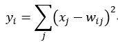

上式w_ij 的值由i的比特图编码确定，i从0到9，j取值从0到7×12-1。RBF输出的值越接近于0，则越接近于i，即越接近于i的ASCII编码图，表示当前网络输入的识别结果是字符i。该层有84x10=840个参数和连接。


上图是LeNet-5识别数字3的过程。

# 四、代码细节

## LeNet5网络结构

如下为定义LeNet5网络结构的代码。首先我们凭借layer.py中的各层定义LeNet5结构。并且定义forward以及backward函数，在其中分别调用每一层u翟营的forward和backward函数，每一层的参数之间逐层传递。

```py
#model
# LeNet5 Model
class LeNet5(object):
    def __init__(self):
        kernel_shape = {"C1": (5, 5, 1, 6),
                        "C3": (5, 5, 6, 16),
                        "C5": (5, 5, 16, 120),
                        "F6": (120, 84),
                        "F7": (84, 10)}
        self.C1 = layer.Conv_Layer(kernel_shape["C1"], sigma=0.1, bias_factor=0.01)
        self.ReLU1 = layer.ReLU_Layer()
        self.S2 = layer.MaxPool_Layer()
        self.C3 = layer.Conv_Layer(kernel_shape["C3"], sigma=0.1, bias_factor=0.01)
        self.ReLU2 = layer.ReLU_Layer()
        self.S4 = layer.MaxPool_Layer()
        self.C5 = layer.Conv_Layer(kernel_shape["C5"], sigma=0.1, bias_factor=0.01)
        self.ReLU3 = layer.ReLU_Layer()
        self.F6 = layer.FC_Layer(kernel_shape["F6"], sigma=0.1, bias_factor=0.01)
        self.ReLU4 = layer.ReLU_Layer()
        self.F7 = layer.FC_Output_Layer(kernel_shape["F7"], sigma=0.1, bias_factor=0.01)

    def forward(self, input_image, input_label, mode):
        C1_FP = self.C1.forward_propagation(input_image)
        ReLU1_FP = self.ReLU1.forward_propagation(C1_FP)
        S2_FP = self.S2.forward_propagation(ReLU1_FP)
        C3_FP = self.C3.forward_propagation(S2_FP)
        ReLU2_FP = self.ReLU2.forward_propagation(C3_FP)
        S4_FP = self.S4.forward_propagation(ReLU2_FP)
        C5_FP = self.C5.forward_propagation(S4_FP)
        ReLU3_FP = self.ReLU3.forward_propagation(C5_FP)
        ReLU3_FP = ReLU3_FP[:, 0, 0, :]
        F6_FP = self.F6.forward_propagation(ReLU3_FP)
        ReLU4_FP = self.ReLU4.forward_propagation(F6_FP)
        return self.F7.forward_propagation(ReLU4_FP, input_label, mode)

    def backward(self, learning_rate):
        F7_BP = self.F7.back_propagation(learning_rate)
        ReLU4_BP = self.ReLU4.back_propagation(F7_BP)
        F6_BP = self.F6.back_propagation(ReLU4_BP, learning_rate)
        F6_BP = F6_BP[:, np.newaxis, np.newaxis, :]
        ReLU3_BP = self.ReLU3.back_propagation(F6_BP)
        C5_BP = self.C5.back_propagation(ReLU3_BP, learning_rate)
        S4_BP = self.S4.back_propagation(C5_BP)
        ReLU2_BP = self.ReLU2.back_propagation(S4_BP)
        C3_BP = self.C3.back_propagation(ReLU2_BP, learning_rate)
        S2_BP = self.S2.back_propagation(C3_BP)
        ReLU1_BP = self.ReLU1.back_propagation(S2_BP)
        self.C1.back_propagation(ReLU1_BP, learning_rate)
```

## layer各层

### ReLU

本实验选取ReLU作为激活函数，前向计算为：

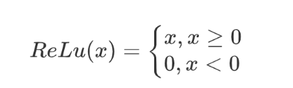

梯度的反向传播为：

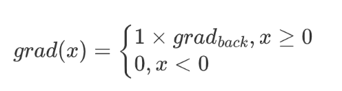

代码如下：

```py
# ReLU激活层
class ReLU_Layer(object):
    def forward_propagation(self, input_map):
        self.input_map = input_map
        return np.where(input_map > 0, input_map, 0)

    def back_propagation(self, d_output_map):
        d_input_map = np.multiply(d_output_map, np.where(self.input_map > 0, 1, 0))
        self.input_map = None
        return d_input_map
```

### Max-Pooling

池化层采取最大池化的方式，通过滤波器筛选出最大的元素作为池化结果，前向计算为：

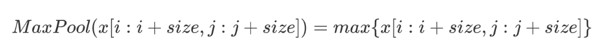

梯度的反向传播中，只有被选择为最大值的元素位置对应会被梯度反向传播，其余均赋值为0：

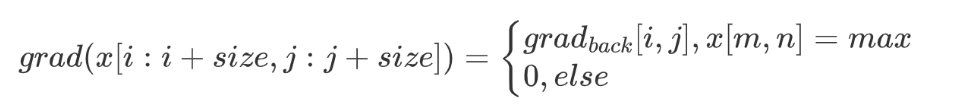

代码如下：

```py
# Max-Pooling层
class MaxPool_Layer(object):
    def __init__(self, stride=2, f=2):
        self.stride = stride
        self.f = f

    def forward_propagation(self, input_map):
        self.input_map = input_map
        batch_size, height_input, width_input, channel = input_map.shape
        height_output = int(1 + (height_input - self.f) / self.stride)
        width_output = int(1 + (width_input - self.f) / self.stride)
        output_map = np.zeros((batch_size, height_output, width_output, channel))
        for height in range(height_output):
            for width in range(width_output):
                vertical_start, vertical_end = height * self.stride, height * self.stride + self.f
                horizontal_start, horizontal_end = width * self.stride, width * self.stride + self.f
                input_map_slice = input_map[:, vertical_start: vertical_end, horizontal_start: horizontal_end, :]
                output_map[:, height, width, :] = np.max(input_map_slice, axis=(1, 2))
        return output_map

    def back_propagation(self, d_output_map):
        _, height_output, width_output, _ = d_output_map.shape
        d_input_map = np.zeros(self.input_map.shape)
        for height in range(height_output):
            for width in range(width_output):
                vertical_start, vertical_end = height * self.stride, height * self.stride + self.f
                horizontal_start, horizontal_end = width * self.stride, width * self.stride + self.f
                input_map_slice = self.input_map[:, vertical_start: vertical_end, horizontal_start: horizontal_end, :]
                input_map_slice = np.transpose(input_map_slice, (1, 2, 3, 0))
                mask = input_map_slice == input_map_slice.max((0, 1))
                mask = np.transpose(mask, (3, 2, 0, 1))
                d_input_map[:, vertical_start: vertical_end, horizontal_start: horizontal_end, :] += np.transpose(
                    np.multiply(d_output_map[:, height, width, :][:, :, np.newaxis, np.newaxis], mask), (0, 2, 3, 1))
        self.input_map = None
        return d_input_map
```

### 卷积层

卷积层前向传播为：

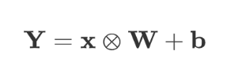

反向传播为：

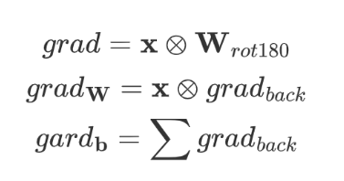

代码如下：

```py
# 卷积层
class Conv_Layer(object):
    def __init__(self, kernel_shape, stride=1, pad=0, sigma=0.1, bias_factor=0.01):
        self.weight, self.bias = initialise(kernel_shape, sigma, bias_factor)
        self.stride = stride
        self.pad = pad

    def forward_propagation(self, input_map):
        self.input_map = input_map
        batch_size, height_input, width_input, _ = input_map.shape
        f, _, _, channel_output = self.weight.shape
        height_output = int((height_input + 2 * self.pad - f) / self.stride + 1)
        width_output = int((width_input + 2 * self.pad - f) / self.stride + 1)
        output_map = np.zeros((batch_size, height_output, width_output, channel_output))
        input_map_pad = zero_pad(input_map, self.pad)
        for height in range(height_output):
            for width in range(width_output):
                vertical_start, vertical_end = height * self.stride, height * self.stride + f
                horizontal_start, horizontal_end = width * self.stride, width * self.stride + f
                input_map_slice = input_map_pad[:, vertical_start: vertical_end, horizontal_start: horizontal_end, :]
                output_map[:, height, width, :] = np.tensordot(input_map_slice, self.weight,
                                                               axes=([1, 2, 3], [0, 1, 2])) + self.bias
        return output_map

    def back_propagation(self, d_output_map, learning_rate):
        f, _, _, channel_output = self.weight.shape
        _, height_output, width_output, channel_output = d_output_map.shape
        d_input_map = np.zeros(self.input_map.shape)
        d_weight = np.zeros(self.weight.shape)
        d_bias = np.zeros((1, 1, 1, channel_output))
        if self.pad != 0:
            input_map_pad = zero_pad(self.input_map, self.pad)
            d_input_map_pad = zero_pad(d_input_map, self.pad)
        else:
            input_map_pad = self.input_map
            d_input_map_pad = d_input_map
        for height in range(height_output):
            for width in range(width_output):
                vertical_start, vertical_end = height * self.stride, height * self.stride + f
                horizontal_start, horizontal_end = width * self.stride, width * self.stride + f
                input_map_slice = input_map_pad[:, vertical_start: vertical_end, horizontal_start: horizontal_end, :]
                d_input_map_pad[:, vertical_start: vertical_end, horizontal_start: horizontal_end, :] += np.transpose(
                    np.dot(self.weight, d_output_map[:, height, width, :].T), (3, 0, 1, 2))
                d_weight += np.dot(np.transpose(input_map_slice, (1, 2, 3, 0)), d_output_map[:, height, width, :])
                d_bias += np.sum(d_output_map[:, height, width, :], axis=0)
        d_input_map = d_input_map_pad if self.pad == 0 else d_input_map_pad[:, self.pad: -self.pad, self.pad: -self.pad,
                                                            :]
        self.weight -= learning_rate * d_weight
        self.bias -= learning_rate * d_bias
        self.input_map = None
        return d_input_map
```

### 全连接层

全连接层前向传播为：

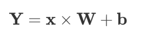

反向传播为：

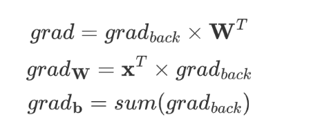

代码如下：

```py
# 全连接层
class FC_Layer(object):
    def __init__(self, weight_shape, sigma=0.1, bias_factor=0.01):
        self.weight, self.bias = initialise(weight_shape, sigma, bias_factor)

    def forward_propagation(self, input_array):
        self.input_array = input_array
        return np.matmul(input_array, self.weight) + self.bias

    def back_propagation(self, d_output_array, learning_rate):
        d_input_array = np.matmul(d_output_array, self.weight.T)
        d_weight = np.matmul(self.input_array.T, d_output_array)
        d_bias = np.sum(d_output_array.T, axis=1)
        self.weight -= learning_rate * d_weight
        self.bias -= learning_rate * d_bias
        self.input_array = None
        return d_input_array

# 全连接输出层
class FC_Output_Layer(object):
    def __init__(self, weight_shape, sigma=0.1, bias_factor=0.01):
        self.weight, self.bias = initialise(weight_shape, sigma, bias_factor)

    def forward_propagation(self, input_array, labels, mode):
        self.input_array = input_array
        self.labels = labels
        self.output_array = np.matmul(input_array, self.weight) + self.bias
        output = softmax(self.output_array)
        predictions = np.argmax(output, axis=1)
        if mode == "train":
            cost_value = -np.log(output[range(output.shape[0]), labels])
            return np.sum(cost_value)
        elif mode == "test":
            error = np.sum(labels != predictions)
            return error, predictions

    def back_propagation(self, learning_rate):
        d_output_array = softmax(self.output_array)
        d_output_array[range(d_output_array.shape[0]), self.labels] -= 1
        d_output_array = d_output_array / d_output_array.shape[0]
        d_input_array = np.matmul(d_output_array, self.weight.T)
        d_weight = np.matmul(self.input_array.T, d_output_array)
        d_bias = np.sum(d_output_array.T, axis=1)
        self.weight -= learning_rate * d_weight
        self.bias -= learning_rate * d_bias
        self.input_array, self.labels, self.output_array = None, None, None
        return d_input_array
```

## 数据预处理

首先我们需要对数据进行读取以及正则化，由于Mnist中数据图片大小为28*28，所以我们对其进行padding为32×32。

```py
import numpy as np
import struct

# 读取数据
def readDataset(dataset_path):
    (image_path, label_path) = dataset_path
    with open(label_path, "rb") as label_file:
        magic, dataset_size = struct.unpack(">II", label_file.read(8))
        label_dataset = np.fromfile(label_file, dtype = np.int8)
    with open(image_path, "rb") as image_file:
        magic, dataset_size, rows, columns = struct.unpack(">IIII", image_file.read(16))
        image_dataset = np.fromfile(image_file, dtype = np.uint8).reshape(len(label_dataset), rows, columns)
    print('Load images from %s, number: %d, data shape: %s' % (dataset_path, dataset_size, str(image_dataset.shape)))
    return (image_dataset, label_dataset)

# padding
def zero_pad(X, pad):
    X_pad = np.pad(X, ((0, ), (pad, ), (pad, ), (0, )), "constant", constant_values = (0, 0))
    return X_pad

# 数据正则化
def normalise(image):
    image -= image.min()
    image = image / image.max()
    image = (image - np.mean(image)) / np.std(image)
    return image

def load_dataset(test_image_path, test_label_path, train_image_path, train_label_path):
    train_dataset = (train_image_path, train_label_path)
    test_dataset = (test_image_path, test_label_path)
    # 读取数据
    train_image, train_label = readDataset(train_dataset)
    test_image, test_label = readDataset(test_dataset)
    # 预处理
    train_image_normalised_pad = normalise(zero_pad(train_image[:, :, :, np.newaxis], 2))
    test_image_normalised_pad = normalise(zero_pad(test_image[:, :, :, np.newaxis], 2))
    print("load data finished")
    return (train_image_normalised_pad, train_label), (test_image_normalised_pad, test_label)
```

## 训练以及测试

为了方便我们进行训练，首先我们定义一个函数，用来打乱数据（方便进行训练）以及讲数据分割为小部分数据来进行训练，这样训练可以更好地训练模型，也可以一定程度上减小过拟合的影响。

在训练中，我们利用tqdm，方便进行训练的可视化，此外，每次记录训练错误数量以及错误率，方便进行数据分析。

```py
def shuffle_data(image, label, batch_size=256, one_batch=False):
    dataset_size = image.shape[0]
    shuffle_batch = []
    # shuffle
    permutation = list(np.random.permutation(dataset_size))
    shuffled_image = image[permutation, :, :, :]
    shuffled_label = label[permutation]
    # 只提取一批
    if one_batch:
        shuffle_image = shuffled_image[0: batch_size, :, :, :]
        shuffle_label = shuffled_label[0: batch_size]
        return (shuffle_image, shuffle_label)
    batch_number = math.floor(dataset_size / batch_size)
    for k in range(0, batch_number):
        shuffle_image = shuffled_image[k * batch_size: k * batch_size + batch_size, :, :, :]
        shuffle_label = shuffled_label[k * batch_size: k * batch_size + batch_size]
        mini_batch = (shuffle_image, shuffle_label)
        shuffle_batch.append(mini_batch)
    if dataset_size % batch_size != 0:
        shuffle_image = shuffled_image[batch_number * batch_size: dataset_size, :, :, :]
        shuffle_label = shuffled_label[batch_number * batch_size: dataset_size]
        mini_batch = (shuffle_image, shuffle_label)
        shuffle_batch.append(mini_batch)
    return shuffle_batch


def train(model, train_data, test_data, epoches, learning_rate, batch_size):
    start_time = time.time()
    err_rate_list = []
    loss_rate_list = []
    acc_rate_list = []
    for epoch in range(0, epoches):
        print("---------- epoch", epoch + 1, "begin ----------")
        start_time_epoch = time.time()
        loss = 0
        shuffle_batch = shuffle_data(train_data[0], train_data[1], batch_size)
        print("Training:")
        for i in tqdm(range(len(shuffle_batch))):
            batch_image, batch_label = shuffle_batch[i]
            loss = model.forward(batch_image, batch_label, 'train')
            model.backward(learning_rate)
        error_train, _ = model.forward(train_data[0], train_data[1], 'test')
        error_test, _ = model.forward(test_data[0], test_data[1], 'test')
        err_rate_list.append([error_train / 60000, error_test / 10000])
        acc_rate_list.append([1 - error_train / 60000, 1 - error_test / 10000])
        loss_rate_list.append(loss)
        print("errors of training set:", error_train, "/", len(train_data[1]))
        print("errors of testing set:", error_test, "/", len(test_data[1]))
        print("Time used:", time.time() - start_time_epoch, "sec")
        print("---------- epoch", epoch + 1, "end ------------")
    err_rate_list = np.array(err_rate_list).T
    acc_rate_list = np.array(acc_rate_list).T
    print("Total time used:", time.time() - start_time, "sec")
    return err_rate_list, acc_rate_list, loss_rate_list


def test(model, test_data):
    errors, predictions = model.forward(test_data[0], test_data[1], "test")
    print("accuracy rate:", 1.0 - (errors / len(predictions)))
    return predictions
```

# 五、实验结果以及对实验结果的分析

部分训练过程如下图所示：

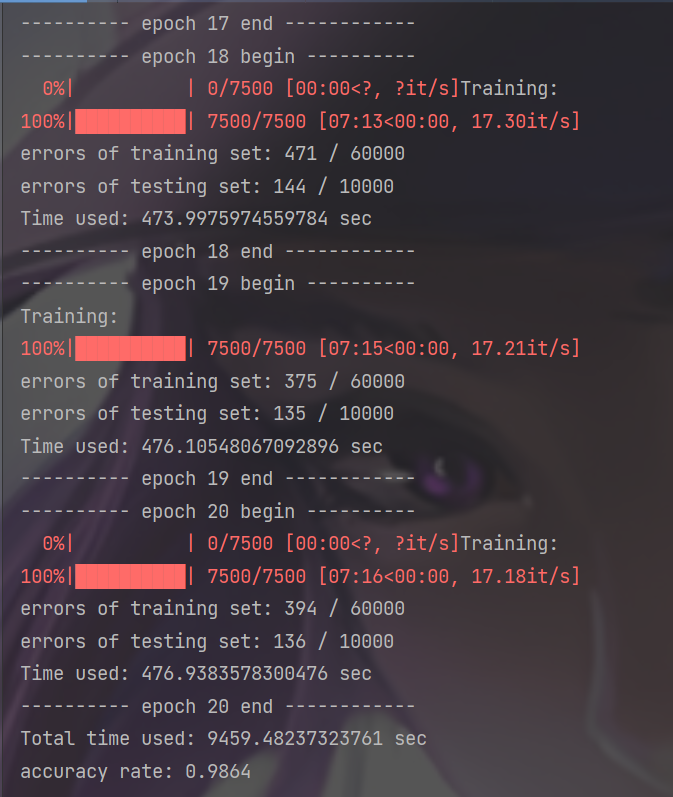

总训练过程在“训练.txt”文件中。

逐次训练的错误率如下图所示：

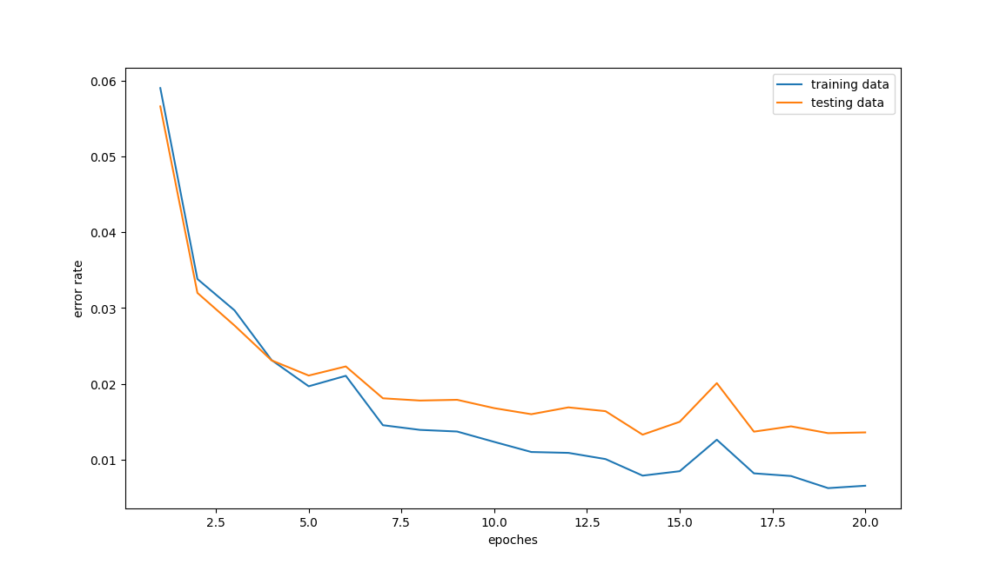

逐次训练的正确率如下图所示：

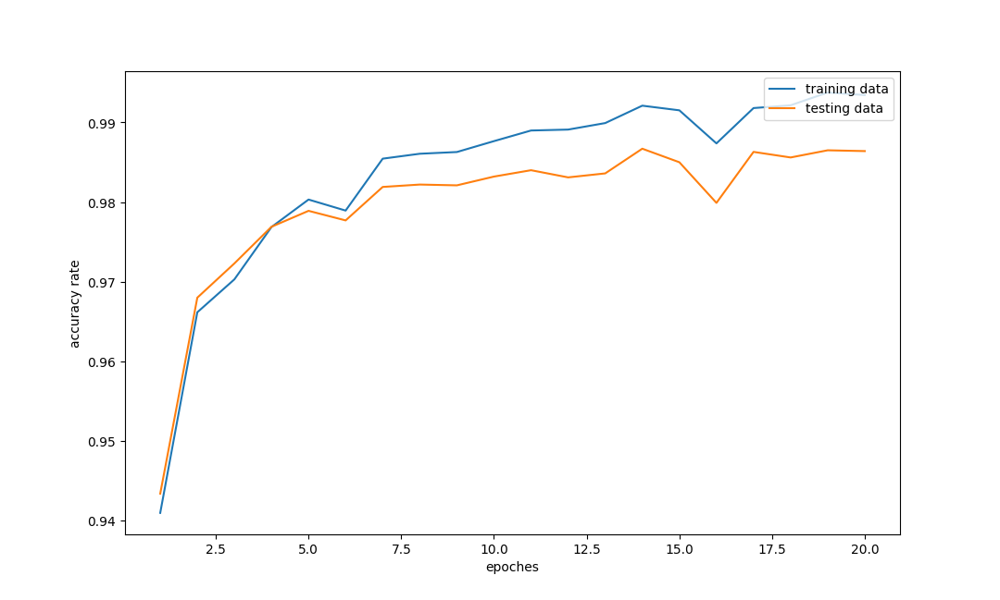

逐次训练的loss值如下图所示：

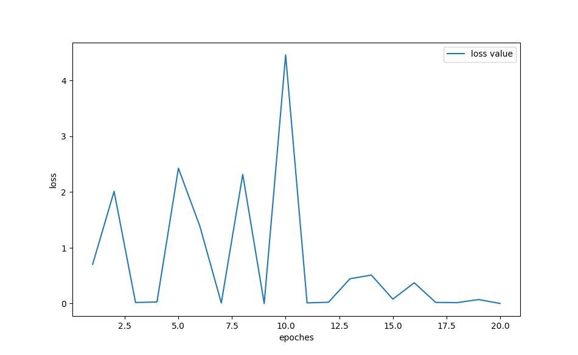

混淆矩阵如下图所示：

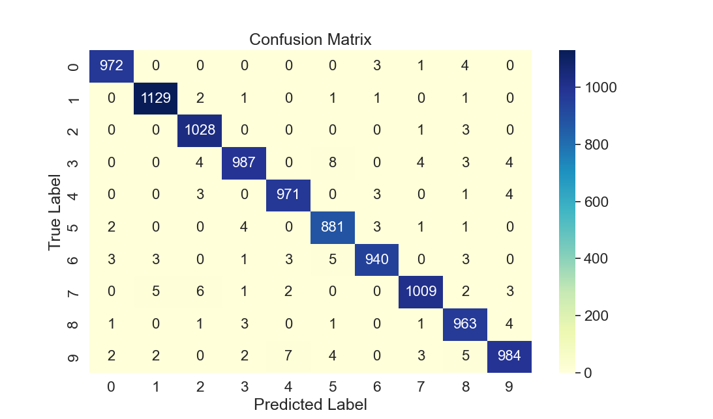

我们可以看到，错误多的地方如“2”和“7”，“1”和“7”，“4”和“9”，“3”和“5”，“5”和“6”等等都是现实中都很容易看错的组合，模型测试错误可以理解。

我们可以看到，最终正确率能达到0.9864。训练中，随着训练次数增加，错误率总体呈下降趋势，正确率总体呈上升趋势，loss值总体呈下降趋势。但是可能由于训练次数不够，或是模型存在过拟合问题，测试集的错误率要高于训练集的错误率，测试集的正确率要低于训练集的正确率。可以通过改变训练次数，或是优化模型、调整超参数等方式来优化结果。

同样，我们也可以根据训练次数来改变学习率，这样也可以在一定程度上优化模型。